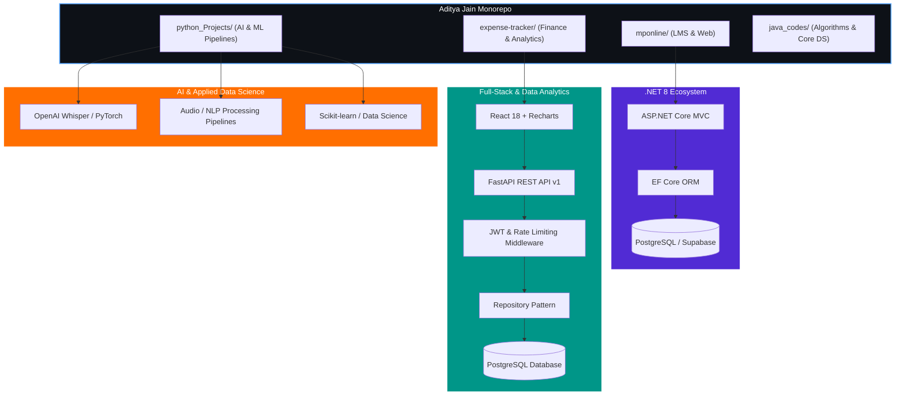

<div align="center">


<p>
  <a href="https://www.linkedin.com/in/aditya-jain0315/"></a>
  <a href="https://github.com/Aditya4860"></a>
  <a href="https://leetcode.com/Aditya4860"></a>
  <a href="mailto:adityaj0315@gmail.com"></a>
</p>

<p>
  
  
  
  
  
</p>

</div>

---

## 👨‍💻 About Me

Welcome to my profile and engineering monorepo! I am **Aditya Jain**, a Computer Science & Engineering student at **VIT Bhopal University**, passionate about building scalable, intelligent, and data-driven software solutions.

- 🤖 **AI & Machine Learning**: Exploring deep learning, NLP, computer vision, and foundation models (OpenAI Whisper, PyTorch, Scikit-learn).
- 📈 **Data Science & Analytics**: End-to-end data pipelines, predictive modeling, statistical analysis, and interactive dashboard analytics (Pandas, NumPy, Matplotlib, Seaborn).
- 🌐 **Full-Stack Development**: Scalable backend architectures with **ASP.NET Core MVC 8 / C#** and **FastAPI / Python**, coupled with modern responsive user interfaces in **React 18** and **Tailwind CSS**.
- 🗄 **Data Engineering & Storage**: Relational schema design, ORM optimization, and indexing with **PostgreSQL**, **SQL Server**, and **MySQL**.

---

## 🛠 Technical Skills & Tools

<div align="center">

<p align="center">
  
</p>

| Category | Technologies |
|---|---|
| **Languages** | Java, Python, C#, SQL, JavaScript |
| **Web Technologies** | HTML5, CSS3, JavaScript, Bootstrap, Streamlit, ASP.NET Core, React 18 |
| **Machine Learning & Data** | Scikit-learn, Pandas, NumPy, Feature Engineering, Model Deployment, PyTorch, OpenAI Whisper |
| **Databases** | MySQL, PostgreSQL, SQL Server |
| **Tools & Platforms** | Git, GitHub, AWS, VS Code, PyCharm, Jupyter Notebook, Visual Studio, Postman, TMDB API, Pickle, Joblib |

</div>

---

## 📊 GitHub Stats & Metrics

<div align="center">
  
</div>

<br/>

<div align="center">
  
</div>

---

## 🚀 Projects Directory

<table>
  <thead>
    <tr>
      <th>Project</th>
      <th>Domain & Stack</th>
      <th>Architectural & Engineering Highlights</th>
      <th>Status</th>
      <th>Repository / Docs</th>
    </tr>
  </thead>
  <tbody>
    <tr>
      <td><strong>Enterprise Library Management System</strong></td>
      <td><code>Full Stack</code> · <code>ASP.NET Core MVC 8</code> · <code>EF Core</code> · <code>PostgreSQL</code></td>
      <td>Role-Based Access Control (Admin/Librarian/Student), automated fine calculation, Chart.js analytics, and 5,000+ realistic seeded records.</td>
      <td></td>
      <td><a href="./mponline/README.md"><strong>Explore LMS →</strong></a></td>
    </tr>
    <tr>
      <td><strong>Smart Expense Tracker & Analytics</strong></td>
      <td><code>Full Stack & Analytics</code> · <code>FastAPI</code> · <code>React 18</code> · <code>PostgreSQL</code></td>
      <td>Repository pattern backend with async SQLAlchemy, JWT dual-token auth, rate limiting, cash flow visualizations, and financial health scoring.</td>
      <td></td>
      <td><a href="./expense-tracker/README.md"><strong>Explore Tracker →</strong></a></td>
    </tr>
    <tr>
      <td><strong>Whisper AI Transcriber</strong></td>
      <td><code>AI & NLP</code> · <code>Python</code> · <code>OpenAI Whisper</code> · <code>FFmpeg</code> · <code>Flask</code></td>
      <td>GPU-accelerated multi-lingual audio/video speech-to-text pipeline with timestamp generation and subtitle formatting.</td>
      <td></td>
      <td><code>python_Projects/</code></td>
    </tr>
    <tr>
      <td><strong>Event Management Platform</strong></td>
      <td><code>Full Stack</code> · <code>ASP.NET Core MVC</code> · <code>SQL Server</code> · <code>Bootstrap 5</code></td>
      <td>Multi-tiered event ticketing, registrant management, dynamic scheduling, and administrator approval pipeline.</td>
      <td></td>
      <td><code>mponline/</code></td>
    </tr>
  </tbody>
</table>

---

## 🌟 Featured Projects Deep Dive

### 1. Enterprise Library Management System (`mponline/`)

[](./mponline/.github/workflows/dotnet.yml)
[](./mponline/README.md)

A robust web application automating enterprise library operations with multi-role access controls, real-time analytics, and automated fee processing.

#### Key Highlights
- **RBAC Security**: Dedicated authorization tiers for *Administrator*, *Librarian*, and *Student*.
- **Book Circulation Engine**: Real-time copy tracking, borrow limits, and overdue fine computing.
- **Periodicals & Publishers Registry**: Structured management for Magazines, Daily Newspapers, and Publication Houses.
- **Enterprise Seeder**: Generates over 5,000 book records and realistic borrowing transactions on initial startup.

#### Quick Start (LMS)
```bash
# Navigate to project
cd mponline/LibraryManagement.MVC

# Setup configuration
cp .env.example .env

# Restore dependencies & run migrations
dotnet restore
dotnet ef database update

# Launch local server
dotnet run
```
*Application runs at `https://localhost:5001`.*

#### Demo Credentials
| Role | Email | Password |
|---|---|---|
| Administrator | `admin@libraryspace.com` | `Password123!` |
| Librarian | `librarian@libraryspace.com` | `Password123!` |
| Student | `student@libraryspace.com` | `Password123!` |

---

### 2. Smart Expense Tracker (`expense-tracker/`)

[](./expense-tracker/README.md)
[](./expense-tracker/README.md)

An end-to-end personal finance and data analytics platform featuring real-time budgeting, multi-category income/expense logging, and interactive financial health scoring.

#### Key Highlights
- **Production-Grade Backend**: FastAPI with async SQLAlchemy, Pydantic v2 schemas, and Alembic migrations.
- **Dual-Token Authentication**: JWT access and refresh tokens with bcrypt password hashing.
- **Hardened Middleware**: Rate limiting, XSS input sanitization, HSTS, and CSP security headers.
- **Frontend SPA & Analytics**: React 18 with 9 Context providers, custom hooks, and Recharts interactive analytics.

#### Quick Start (Expense Tracker)
```bash
# 1. Backend Setup
cd expense-tracker/backend
python -m venv .venv
.venv\Scripts\activate          # Windows (or source .venv/bin/activate on Unix)
pip install -r requirements.txt
cp .env.example .env
alembic upgrade head
uvicorn main:app --reload

# 2. Frontend Setup (New Terminal)
cd expense-tracker/frontend
npm install
npm run dev
```
*API docs available at `http://127.0.0.1:8000/docs`. Frontend runs at `http://localhost:5173`.*

---

## 🖼 Visual Showcase

<div align="center">
  <table>
    <tr>
      <td width="50%">
        
        <p align="center"><b>LMS: Modern Landing Page</b></p>
      </td>
      <td width="50%">
        
        <p align="center"><b>LMS: Analytics Dashboard</b></p>
      </td>
    </tr>
    <tr>
      <td width="50%">
        
        <p align="center"><b>LMS: Catalog & Filter System</b></p>
      </td>
      <td width="50%">
        
        <p align="center"><b>LMS: Financial & Operational Reports</b></p>
      </td>
    </tr>
  </table>
</div>

---

## 🏛 System Architecture



---

## 📁 Repository Structure

```text
.
├── .github/
│   ├── ISSUE_TEMPLATE/           # Standardized bug report and feature request templates
│   └── PULL_REQUEST_TEMPLATE.md  # Comprehensive pull request checklist
│
├── mponline/                     # Project 1: Library Management System (.NET 8 MVC)
│   ├── .github/workflows/        # CI/CD: Automated .NET 8 build and validation
│   ├── LibraryManagement.MVC/    # Application source code
│   │   ├── Controllers/          # 12 MVC Controllers (Books, Borrow, Fines, Reports...)
│   │   ├── Models/               # 9 Domain Entities (Book, Student, Fine, Magazine...)
│   │   ├── Views/                # Server-rendered Razor views with bespoke design system
│   │   ├── Data/                 # EF Core DbContext & Database Configurations
│   │   ├── DbSeeder.cs           # Seed generator (5,000+ books & borrow records)
│   │   ├── Program.cs            # Middleware pipeline & Dependency Injection container
│   │   └── .env.example          # Safe environment variable configuration template
│   ├── docs/                     # 14 high-resolution UI screenshots & Mermaid diagrams
│   ├── scripts/                  # Data ingestion & diagram generation utilities
│   ├── CONTRIBUTING.md           # LMS contribution guidelines
│   ├── LICENSE                   # MIT License
│   └── README.md                 # Complete technical documentation
│
├── expense-tracker/              # Project 2: Smart Expense Tracker & Analytics (React + FastAPI)
│   ├── frontend/                 # React 18 Single Page Application
│   │   ├── src/
│   │   │   ├── pages/            # 12 route views (Dashboard, Expenses, Income, Budget...)
│   │   │   ├── components/       # Shared UI component library (Modals, Charts, Skeletons)
│   │   │   ├── context/          # 9-provider global Context API state tree
│   │   │   └── hooks/            # Domain-scoped custom React hooks
│   │   └── package.json
│   ├── backend/                  # Production-hardened FastAPI backend
│   │   ├── app/
│   │   │   ├── api/v1/           # Versioned REST endpoints (Auth, Expenses, Analytics...)
│   │   │   ├── core/             # Security, rate limiter, input sanitizer, database
│   │   │   ├── models/           # SQLAlchemy ORM database models
│   │   │   ├── schemas/          # Pydantic v2 validation schemas
│   │   │   └── repositories/     # Repository pattern data access layer
│   │   ├── alembic/              # Database migration version scripts
│   │   ├── tests/                # Automated pytest security and route test suite
│   │   ├── main.py               # Application entry point with security middleware stack
│   │   └── requirements.txt      # Python dependencies
│   ├── docs/                     # API specification, architectural designs, roadmap
│   ├── CHANGELOG.md              # Version release notes
│   ├── LICENSE                   # MIT License
│   └── README.md                 # Complete technical documentation
│
├── python_Projects/              # ML experiments, OpenAI Whisper audio pipelines, Python utilities
├── java_codes/                   # Data Structures and Algorithms implementations
├── .gitignore                    # Enterprise multi-stack git exclusions (.NET, Node, Python, Java)
├── CONTRIBUTING.md               # Monorepo contribution standards & Conventional Commits
├── CODE_OF_CONDUCT.md            # Contributor Covenant v2.1 standard
├── SECURITY.md                   # Security vulnerability reporting policy
├── LICENSE                       # MIT License
└── README.md                     # Monorepo landing page
```

---

## 🤝 Contributing & Standards

We welcome contributions from the open-source community! Please review our [Contributing Guidelines](CONTRIBUTING.md) and [Code of Conduct](CODE_OF_CONDUCT.md) before submitting pull requests.

We enforce **[Conventional Commits](https://www.conventionalcommits.org/)** on all branches:
- `feat:` New features or capabilities
- `fix:` Bug fixes and corrections
- `docs:` Documentation updates
- `refactor:` Code refactoring without logic modification
- `perf:` Performance optimizations
- `ci:` Continuous Integration changes

---

## 📜 License

This repository is distributed under the **[MIT License](LICENSE)**.

---

<div align="center">
  <b>Developed with precision by Aditya Jain</b><br/>
  <i>Software Engineer · Full Stack · AI & Machine Learning · Data Science</i><br/><br/>
  
</div>
